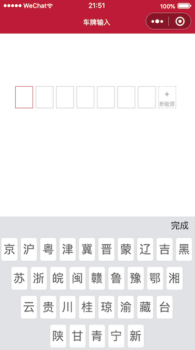

# plateKeyboard
## 微信小程序车牌号输入键盘、输入框

因项目需求，需自定义车牌输入框、车牌输入键盘。现将车牌输入键盘整合成一个组件，车牌输入框整合成一个 template 模板，在需要的页面引用即可。
```
    <!-- 输入框 -->
    <view class='input-container'>
        <template is="inputField" data="{{plate}}"></template>
    </view>
    <!-- 键盘 -->
    <plateKeyboard showPlateKeyboard="{{isShowKeyboard}}" plate="{{plate}}"
        bind:plateKeyboardChange="onPlateKeyboardValueChange"></plateKeyboard>
```
有需要的童学，可以自行下载，根据自己的需求进行相应修改。效果如下图

  
